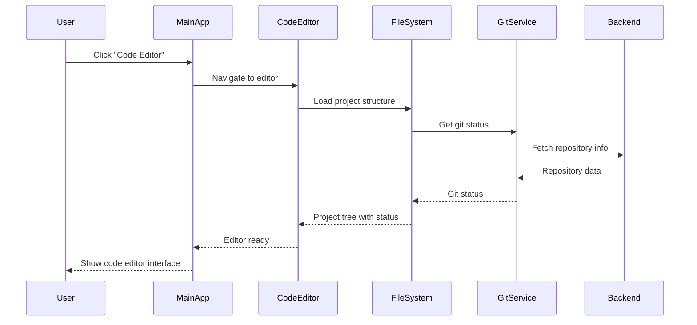
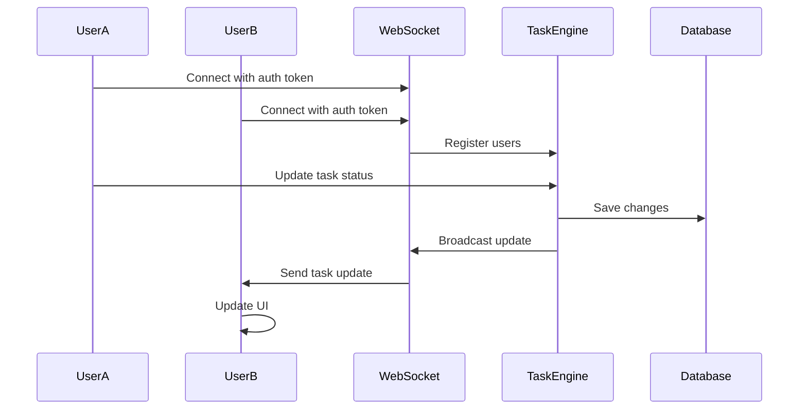
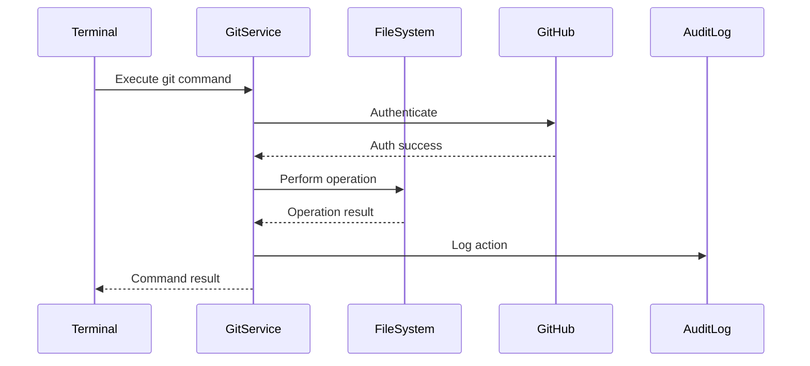

# Design Document

## Overview

This design extends the existing DevGuard AI Copilot architecture to complete the full AI-powered code editor application with integrated DevOps and collaboration features. The design focuses on implementing a comprehensive member onboarding system with admin approval workflows, secure multi-factor authentication, pre-login user experience, role-based dashboard access, embedded terminal with git operations, and advanced task management with confidentiality controls.

## Architecture

### Enhanced System Architecture

```mermaid
graph TB
    subgraph "Frontend Layer"
        Landing[Pre-Login Landing Page]
        Auth[Authentication Flow]
        AdminDash[Admin Dashboard]
        LeadDash[Lead Developer Dashboard]
        DevDash[Developer Dashboard]
        ViewerDash[Viewer Dashboard]
        CodeEditor[Integrated Code Editor]
        Terminal[Embedded Terminal]
        TaskPanel[Task Management Panel]
    end
    
    subgraph "Backend API Layer"
        Gateway[API Gateway]
        AuthAPI[Authentication API]
        OnboardAPI[Onboarding API]
        UserAPI[User Management API]
        TaskAPI[Task Management API]
        RepoAPI[Repository API]
        GitAPI[Git Operations API]
        DeployAPI[Deployment API]
        WebSocket[WebSocket Service]
    end
    
    subgraph "Business Logic Layer"
        OnboardEngine[Onboarding Engine]
        AuthEngine[Authentication Engine]
        TaskEngine[Task Management Engine]
        GitOps[Git Operations Service]
        Pipeline[CI/CD Pipeline Manager]
        Security[Security Monitor]
        RBAC[Role-Based Access Control]
    end
    
    subgraph "Data Layer"
        DB[(SQLite Database)]
        FileStore[Local File System]
        GitRepo[Git Repositories]
        Sessions[Session Store]
    end
    
    subgraph "External Services"
        GitHub[GitHub/GitLab API]
        OAuth[GitHub OAuth]
        Email[Email Service]
        CI[CI/CD Platforms]
    end
    
    Landing --> AuthAPI
    Auth --> OnboardAPI
    AdminDash --> UserAPI
    CodeEditor --> RepoAPI
    Terminal --> GitAPI
    TaskPanel --> TaskAPI
    
    Gateway --> AuthAPI
    Gateway --> OnboardAPI
    Gateway --> UserAPI
    Gateway --> TaskAPI
    Gateway --> RepoAPI
    Gateway --> GitAPI
    
    OnboardAPI --> OnboardEngine
    AuthAPI --> AuthEngine
    TaskAPI --> TaskEngine
    GitAPI --> GitOps
    
    OnboardEngine --> DB
    AuthEngine --> Sessions
    TaskEngine --> DB
    GitOps --> GitRepo
    RBAC --> DB
    
    AuthEngine --> OAuth
    OnboardEngine --> Email
    GitOps --> GitHub
```



### Technology Stack Enhancement

**Backend APIs:**
- Node.js with Express.js for REST APIs
- Socket.io for WebSocket real-time communication
- JWT for authentication and authorization
- Multer for file upload handling
- Node-git for git operations

**Real-time Communication:**
- Socket.io for WebSocket connections
- Redis for message queuing and caching
- Event-driven architecture for notifications

**File System Integration:**
- Chokidar for file system watching
- Node.js fs module for file operations
- Git integration via nodegit or simple-git

## Components and Interfaces

### Enhanced Frontend Components

#### Pre-Login Landing Page
```typescript
interface LandingPage {
  // Main entry options
  showJoinProjectOption(): void;
  showLoginOption(): void;
  displayDashboardPreview(): void;
  
  // Join project flow
  renderJoinRequestForm(): JoinRequestForm;
  submitJoinRequest(request: JoinRequest): Promise<SubmissionResult>;
  
  // Login flow
  renderLoginForm(): LoginForm;
  handleEmailPasswordLogin(credentials: LoginCredentials): Promise<AuthResult>;
  handleGitHubOAuth(): Promise<AuthResult>;
  
  // Responsive design
  adaptToScreenSize(): void;
  showRoleBasedPreviews(): RoleDashboardPreview[];
}
```

#### Onboarding System Interface
```typescript
interface OnboardingSystem {
  // Join request management
  submitJoinRequest(request: JoinRequest): Promise<RequestResult>;
  trackRequestStatus(requestId: string): Promise<RequestStatus>;
  
  // Admin approval workflow
  getPendingRequests(): Promise<JoinRequest[]>;
  approveRequest(requestId: string, adminNotes?: string): Promise<ApprovalResult>;
  rejectRequest(requestId: string, reason: string): Promise<RejectionResult>;
  
  // Account creation
  generateUserAccount(approvedRequest: JoinRequest): Promise<UserAccount>;
  sendCredentials(user: UserAccount): Promise<DeliveryResult>;
}
```

#### Enhanced Terminal Interface
```typescript
interface FullTerminalInterface {
  executeCommand(command: string): Promise<CommandResult>;
  handleGitOperations(gitCommand: GitCommand): Promise<GitResult>;
  authenticateGitOperations(): Promise<AuthResult>;
  streamOutput(): Observable<TerminalOutput>;
  
  // Git-specific operations
  cloneRepository(url: string, path: string): Promise<CloneResult>;
  commitChanges(message: string, files: string[]): Promise<CommitResult>;
  pushChanges(remote: string, branch: string): Promise<PushResult>;
  pullChanges(remote: string, branch: string): Promise<PullResult>;
}
```

#### Enhanced File Explorer
```typescript
interface EnhancedFileExplorer {
  displayProjectStructure(): ProjectTree;
  showGitStatus(): GitStatusIndicators;
  handleFileOperations(): FileOperationMenu;
  searchFiles(query: string): SearchResults;
  
  // Context menu operations
  gitAdd(files: string[]): Promise<void>;
  gitCommit(files: string[], message: string): Promise<void>;
  showDiff(file: string): Promise<DiffView>;
  resolveConflicts(file: string): Promise<ConflictResolution>;
}
```

### Backend API Interfaces

#### User Management API
```typescript
interface UserManagementAPI {
  // CRUD operations
  createUser(userData: CreateUserRequest): Promise<User>;
  getUser(userId: string): Promise<User>;
  updateUser(userId: string, updates: UpdateUserRequest): Promise<User>;
  deleteUser(userId: string): Promise<void>;
  
  // Role management
  assignRole(userId: string, role: UserRole): Promise<void>;
  updatePermissions(userId: string, permissions: Permission[]): Promise<void>;
  
  // Team management
  getTeamMembers(): Promise<TeamMember[]>;
  updateTeamMemberStatus(userId: string, status: MemberStatus): Promise<void>;
}
```

#### Task Management API
```typescript
interface TaskManagementAPI {
  // Task CRUD
  createTask(taskData: CreateTaskRequest): Promise<Task>;
  getTasks(filters: TaskFilters): Promise<Task[]>;
  updateTask(taskId: string, updates: UpdateTaskRequest): Promise<Task>;
  deleteTask(taskId: string): Promise<void>;
  
  // Assignment and tracking
  assignTask(taskId: string, assigneeId: string): Promise<void>;
  updateTaskStatus(taskId: string, status: TaskStatus): Promise<void>;
  trackProgress(taskId: string): Promise<TaskProgress>;
  
  // Confidentiality controls
  setTaskConfidentiality(taskId: string, level: ConfidentialityLevel): Promise<void>;
  getAuthorizedTasks(userId: string): Promise<Task[]>;
  auditTaskAccess(taskId: string, userId: string): Promise<void>;
}
```

#### Repository Management API
```typescript
interface RepositoryAPI {
  // Repository operations
  cloneRepository(repoUrl: string, localPath: string): Promise<Repository>;
  getRepositories(userId: string): Promise<Repository[]>;
  updateRepository(repoId: string, updates: RepositoryUpdate): Promise<Repository>;
  
  // File operations
  getFileContent(repoId: string, filePath: string): Promise<FileContent>;
  updateFileContent(repoId: string, filePath: string, content: string): Promise<void>;
  createFile(repoId: string, filePath: string, content: string): Promise<void>;
  deleteFile(repoId: string, filePath: string): Promise<void>;
  
  // Git operations
  commitChanges(repoId: string, commitData: CommitRequest): Promise<Commit>;
  createPullRequest(repoId: string, prData: PullRequestRequest): Promise<PullRequest>;
  mergePullRequest(repoId: string, prId: string): Promise<MergeResult>;
}
```

#### WebSocket Service Interface
```typescript
interface WebSocketService {
  // Connection management
  handleConnection(socket: Socket): void;
  authenticateSocket(socket: Socket, token: string): Promise<boolean>;
  joinRoom(socket: Socket, roomId: string): void;
  
  // Real-time events
  broadcastTaskUpdate(taskId: string, update: TaskUpdate): void;
  broadcastSecurityAlert(alert: SecurityAlert): void;
  broadcastDeploymentStatus(deploymentId: string, status: DeploymentStatus): void;
  broadcastTeamMemberStatus(userId: string, status: MemberStatus): void;
  
  // File collaboration
  broadcastFileChange(repoId: string, filePath: string, change: FileChange): void;
  handleConflictResolution(repoId: string, filePath: string, resolution: ConflictResolution): void;
}
```

## Data Models

### Enhanced Task Model
```typescript
interface Task {
  id: string;
  title: string;
  description: string;
  type: 'feature' | 'bug' | 'security' | 'deployment' | 'research';
  priority: 'low' | 'medium' | 'high' | 'critical';
  status: 'pending' | 'in_progress' | 'review' | 'testing' | 'completed' | 'blocked';
  
  // Assignment and tracking
  assigneeId: string;
  reporterId: string;
  estimatedHours: number;
  actualHours: number;
  dueDate: Date;
  
  // Confidentiality controls
  confidentialityLevel: 'public' | 'team' | 'restricted' | 'confidential';
  authorizedUsers: string[];
  authorizedRoles: string[];
  
  // Integration
  relatedCommits: string[];
  relatedPullRequests: string[];
  dependencies: string[];
  blockedBy: string[];
  
  // Audit trail
  createdAt: Date;
  updatedAt: Date;
  statusHistory: TaskStatusChange[];
  accessLog: TaskAccessLog[];
}
```

### Repository Model
```typescript
interface Repository {
  id: string;
  name: string;
  description: string;
  localPath: string;
  remoteUrl: string;
  
  // Git information
  currentBranch: string;
  branches: Branch[];
  lastCommit: Commit;
  status: GitStatus;
  
  // Access control
  ownerId: string;
  collaborators: Collaborator[];
  accessLevel: 'private' | 'team' | 'public';
  
  // Integration
  connectedTasks: string[];
  deploymentConfig: DeploymentConfig;
  
  // Metadata
  language: string;
  framework: string;
  createdAt: Date;
  updatedAt: Date;
  lastActivity: Date;
}
```

### File System Model
```typescript
interface FileSystemNode {
  path: string;
  name: string;
  type: 'file' | 'directory';
  size: number;
  
  // Git status
  gitStatus: 'untracked' | 'modified' | 'added' | 'deleted' | 'renamed' | 'clean';
  lastCommit: string;
  
  // Metadata
  language?: string;
  encoding: string;
  permissions: FilePermissions;
  
  // Timestamps
  createdAt: Date;
  modifiedAt: Date;
  accessedAt: Date;
  
  // Hierarchy
  parent?: string;
  children?: FileSystemNode[];
}
```

### WebSocket Event Models
```typescript
interface WebSocketEvent {
  type: string;
  timestamp: Date;
  userId: string;
  data: any;
}

interface TaskUpdateEvent extends WebSocketEvent {
  type: 'task_update';
  data: {
    taskId: string;
    changes: Partial<Task>;
    previousState: Partial<Task>;
  };
}

interface FileChangeEvent extends WebSocketEvent {
  type: 'file_change';
  data: {
    repoId: string;
    filePath: string;
    changeType: 'created' | 'modified' | 'deleted' | 'renamed';
    content?: string;
    diff?: string;
  };
}

interface SecurityAlertEvent extends WebSocketEvent {
  type: 'security_alert';
  data: {
    alertId: string;
    severity: 'low' | 'medium' | 'high' | 'critical';
    message: string;
    affectedUsers: string[];
  };
}
```

## Integration Architecture

### Code Editor Integration Flow


### Real-time Collaboration Flow


### Git Operations Integration


## Security and Performance Considerations

### Security Enhancements
- **API Security**: All endpoints protected with JWT authentication and role-based authorization
- **File Access Control**: File operations restricted based on repository permissions
- **Git Authentication**: Secure token management for GitHub/GitLab operations
- **WebSocket Security**: Socket connections authenticated and authorized
- **Audit Logging**: All operations logged with user context and reasoning

### Performance Optimizations
- **Lazy Loading**: File trees and large repositories loaded on demand
- **Caching Strategy**: Redis caching for frequently accessed data
- **WebSocket Optimization**: Efficient event broadcasting with room-based targeting
- **File System Watching**: Optimized file change detection with debouncing
- **Database Indexing**: Proper indexing for task queries and user lookups

### Scalability Design
- **Horizontal Scaling**: API services designed for load balancing
- **Database Optimization**: Efficient queries with proper indexing
- **Memory Management**: Careful memory usage in file operations
- **Connection Pooling**: Efficient database and external API connections

## Testing Strategy

### Integration Testing
- **API Testing**: Comprehensive endpoint testing with different user roles
- **WebSocket Testing**: Real-time event testing with multiple clients
- **Git Operations Testing**: End-to-end git workflow testing
- **File System Testing**: File operations with concurrent access
- **Security Testing**: Permission and authentication testing

### Performance Testing
- **Load Testing**: Multiple concurrent users and operations
- **File System Performance**: Large repository handling
- **WebSocket Performance**: High-frequency event broadcasting
- **Database Performance**: Complex queries under load

### User Experience Testing
- **Role-based Testing**: Each user role's complete workflow
- **Cross-platform Testing**: Consistent behavior across platforms
- **Offline Capability Testing**: Graceful degradation without network
- **Error Handling Testing**: User-friendly error messages and recovery

This design provides a comprehensive foundation for completing the AI-powered code editor application with all the advanced features specified in the requirements while maintaining security, performance, and scalability.