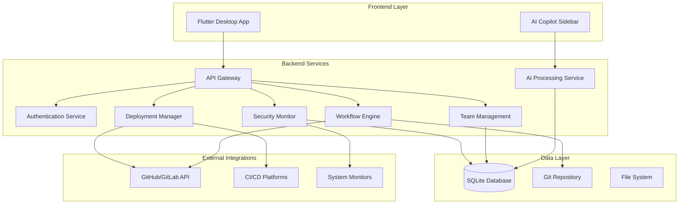
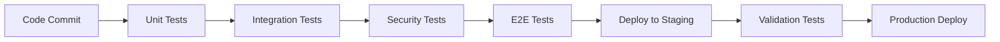

# Design Document

## Overview

DevGuard AI Copilot is architected as a cross-platform desktop application with a Flutter frontend and a multi-service backend. The system follows a microservices architecture pattern to ensure modularity, scalability, and maintainability. The design emphasizes security-first principles, human oversight, and transparent operations while maintaining cost-effectiveness through the use of free and open-source technologies.

## Architecture

### High-Level Architecture



### Technology Stack

**Frontend:**
- Flutter 3.x for cross-platform desktop development
- Provider/Riverpod for state management
- HTTP client for API communication
- Local storage for caching and offline capabilities

**Backend:**
- Node.js with Express.js for API services
- SQLite for local data storage
- Git integration via libgit2 bindings
- WebSocket for real-time updates

**Security & Monitoring:**
- OSSEC or Wazuh for system monitoring
- Custom database monitoring with honeytoken implementation
- Network monitoring via netstat and custom scripts

## Components and Interfaces

### Frontend Components

#### Main Application Shell
```typescript
interface AppShell {
  topBar: TopBarComponent;
  leftSidebar: NavigationSidebar;
  mainCanvas: DashboardCanvas;
  rightSidebar: CopilotSidebar;
  themeManager: ThemeManager;
}
```

#### Dashboard Components
```typescript
interface DashboardCanvas {
  homeDashboard: HomeDashboard;
  workflowDashboard: WorkflowDashboard;
  securityDashboard: SecurityDashboard;
  teamDashboard: TeamDashboard;
  deploymentDashboard: DeploymentDashboard;
  settingsDashboard: SettingsDashboard;
}
```

#### AI Copilot Interface
```typescript
interface CopilotSidebar {
  chatInterface: ChatInterface;
  quickCommands: QuickCommandPanel;
  contextualHelp: ContextualHelpPanel;
  expandableView: FullScreenCopilot;
}
```

### Backend Service Interfaces

#### API Gateway
```typescript
interface APIGateway {
  authenticate(request: Request): Promise<AuthResult>;
  routeRequest(request: Request): Promise<Response>;
  validatePermissions(user: User, action: string): boolean;
  logActivity(activity: ActivityLog): void;
}
```

#### Workflow Engine
```typescript
interface WorkflowEngine {
  processSpecification(spec: NaturalLanguageSpec): Promise<WorkflowPlan>;
  generateCommits(plan: WorkflowPlan): Promise<GitCommit[]>;
  createPullRequest(commits: GitCommit[]): Promise<PullRequest>;
  trackProgress(workflowId: string): Promise<WorkflowStatus>;
}
```

#### Security Monitor
```typescript
interface SecurityMonitor {
  deployHoneytokens(): Promise<void>;
  monitorDatabaseAccess(): Promise<SecurityAlert[]>;
  detectSystemAnomalies(): Promise<SystemAlert[]>;
  analyzeNetworkTraffic(): Promise<NetworkAlert[]>;
  generateAlertExplanation(alert: Alert): Promise<string>;
}
```

#### Deployment Manager
```typescript
interface DeploymentManager {
  scaffoldPipeline(spec: DeploymentSpec): Promise<PipelineConfig>;
  createSnapshot(environment: string): Promise<Snapshot>;
  executeDeploy(config: PipelineConfig): Promise<DeploymentResult>;
  rollback(snapshotId: string): Promise<RollbackResult>;
}
```

## Data Models

### Core Entities

#### TeamMember
```typescript
interface TeamMember {
  id: string;
  name: string;
  email: string;
  role: 'developer' | 'admin' | 'security_reviewer';
  status: 'active' | 'bench' | 'offline';
  assignments: TaskAssignment[];
  expertise: string[];
  workload: number;
  createdAt: Date;
  updatedAt: Date;
}
```

#### Task
```typescript
interface Task {
  id: string;
  title: string;
  description: string;
  type: 'feature' | 'bug' | 'security' | 'deployment';
  priority: 'low' | 'medium' | 'high' | 'critical';
  status: 'pending' | 'in_progress' | 'review' | 'completed' | 'blocked';
  assigneeId: string;
  estimatedHours: number;
  actualHours: number;
  relatedCommits: string[];
  dependencies: string[];
  createdAt: Date;
  dueDate: Date;
  completedAt?: Date;
}
```

#### SecurityAlert
```typescript
interface SecurityAlert {
  id: string;
  type: 'database_breach' | 'system_anomaly' | 'network_anomaly' | 'auth_flood';
  severity: 'low' | 'medium' | 'high' | 'critical';
  title: string;
  description: string;
  aiExplanation: string;
  triggerData: any;
  status: 'new' | 'investigating' | 'resolved' | 'false_positive';
  assignedTo?: string;
  detectedAt: Date;
  resolvedAt?: Date;
  rollbackSuggested: boolean;
  evidence: Evidence[];
}
```

#### Deployment
```typescript
interface Deployment {
  id: string;
  environment: 'development' | 'staging' | 'production';
  version: string;
  status: 'pending' | 'in_progress' | 'success' | 'failed' | 'rolled_back';
  pipelineConfig: PipelineConfig;
  snapshotId: string;
  deployedBy: string;
  deployedAt: Date;
  rollbackAvailable: boolean;
  healthChecks: HealthCheck[];
  logs: DeploymentLog[];
}
```

#### WorkflowPlan
```typescript
interface WorkflowPlan {
  id: string;
  originalSpec: string;
  parsedRequirements: Requirement[];
  generatedTasks: Task[];
  estimatedTimeline: Timeline;
  requiredApprovals: Approval[];
  gitStrategy: GitStrategy;
  testingStrategy: TestingStrategy;
  createdAt: Date;
  status: 'draft' | 'approved' | 'in_progress' | 'completed';
}
```

### Supporting Models

#### Evidence
```typescript
interface Evidence {
  type: 'log' | 'screenshot' | 'network_trace' | 'database_query';
  data: any;
  timestamp: Date;
  source: string;
}
```

#### Snapshot
```typescript
interface Snapshot {
  id: string;
  environment: string;
  gitCommit: string;
  databaseBackup: string;
  configFiles: string[];
  createdAt: Date;
  verified: boolean;
}
```

## Error Handling

### Error Categories

1. **User Input Errors**: Invalid specifications, malformed requests
2. **System Errors**: Database failures, network issues, service unavailability
3. **Security Errors**: Authentication failures, authorization violations, suspicious activities
4. **Integration Errors**: Git operation failures, CI/CD pipeline errors, external API failures

### Error Handling Strategy

```typescript
interface ErrorHandler {
  handleUserError(error: UserError): UserFriendlyMessage;
  handleSystemError(error: SystemError): RecoveryAction;
  handleSecurityError(error: SecurityError): SecurityResponse;
  handleIntegrationError(error: IntegrationError): FallbackAction;
}
```

### Recovery Mechanisms

- **Graceful Degradation**: Core functionality remains available when non-critical services fail
- **Retry Logic**: Automatic retry with exponential backoff for transient failures
- **Circuit Breaker**: Prevent cascade failures by temporarily disabling failing services
- **Rollback Capability**: Automatic rollback triggers for critical system failures

## Testing Strategy

### Testing Pyramid

#### Unit Tests (70%)
- Individual component testing
- Service method testing
- Data model validation
- Utility function testing

#### Integration Tests (20%)
- API endpoint testing
- Database integration testing
- Git operation testing
- External service integration testing

#### End-to-End Tests (10%)
- Complete user workflow testing
- Security scenario testing
- Deployment pipeline testing
- Cross-platform compatibility testing

### Security Testing

#### Penetration Testing
- Honeytoken effectiveness validation
- SQL injection prevention
- Authentication bypass attempts
- Authorization escalation testing

#### Anomaly Detection Testing
- False positive rate measurement
- Detection accuracy validation
- Response time benchmarking
- Alert fatigue prevention

### Performance Testing

#### Load Testing
- Concurrent user simulation
- Database performance under load
- API response time measurement
- Memory usage optimization

#### Stress Testing
- System behavior under extreme conditions
- Resource exhaustion scenarios
- Recovery time measurement
- Data integrity validation

### Automated Testing Pipeline



### Test Data Management

- **Synthetic Data Generation**: Automated creation of test data that mimics production patterns
- **Data Anonymization**: Production data sanitization for testing environments
- **Honeytoken Testing**: Dedicated test honeytokens that don't interfere with production monitoring
- **Environment Isolation**: Strict separation between test and production data

This design provides a robust, scalable, and secure foundation for the DevGuard AI Copilot application while maintaining the cost-effectiveness and transparency requirements outlined in the specifications.