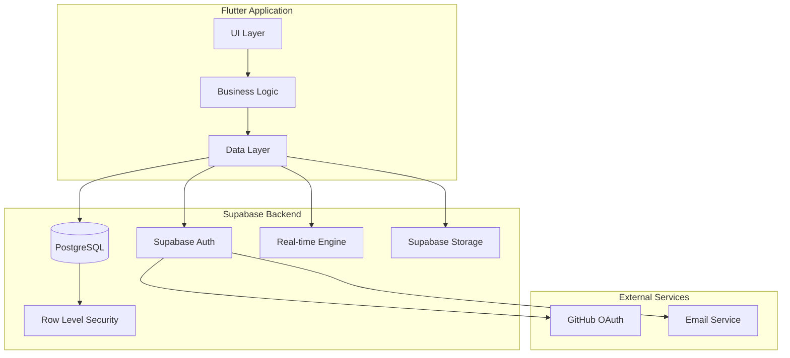
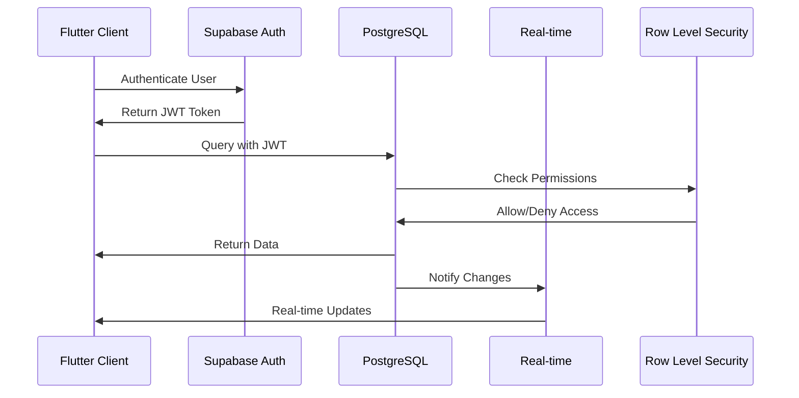

# Design Document

## Overview

This design outlines the migration from SQLite to Supabase, transforming the DevGuard AI Copilot from a local database application to a cloud-native, real-time collaborative platform. The migration involves replacing the entire data layer, authentication system, and introducing real-time capabilities while maintaining existing functionality and improving scalability.

The migration will leverage Supabase's PostgreSQL database, built-in authentication, Row-Level Security (RLS), real-time subscriptions, and storage capabilities to create a modern, secure, and scalable backend architecture.

## Architecture

### High-Level Architecture



### Data Flow Architecture



## Components and Interfaces

### 1. Supabase Client Service

**Purpose**: Central service for managing Supabase client initialization and configuration.

**Key Responsibilities**:
- Initialize Supabase client with environment configuration
- Manage connection state and error handling
- Provide singleton access to Supabase client

**Interface**:
```dart
class SupabaseService {
  static SupabaseService get instance;
  SupabaseClient get client;
  Future<void> initialize();
  bool get isInitialized;
}
```

### 2. Authentication Service (Supabase)

**Purpose**: Replace existing JWT-based authentication with Supabase Auth.

**Key Responsibilities**:
- Email/password authentication
- GitHub OAuth integration
- Session management
- Password reset functionality
- Role-based access control integration

**Interface**:
```dart
class SupabaseAuthService {
  Future<AuthResult> signInWithEmail(String email, String password);
  Future<AuthResult> signInWithGitHub();
  Future<AuthResult> signUp(String email, String password, Map<String, dynamic> metadata);
  Future<void> signOut();
  Future<void> resetPassword(String email);
  Stream<AuthState> get authStateChanges;
  User? get currentUser;
  String? get currentToken;
}
```

### 3. Database Services (Supabase)

**Purpose**: Replace SQLite-based services with Supabase PostgreSQL operations.

**Key Services**:
- `SupabaseTeamMemberService`
- `SupabaseTaskService`
- `SupabaseSecurityAlertService`
- `SupabaseAuditLogService`
- `SupabaseDeploymentService`
- `SupabaseSnapshotService`
- `SupabaseSpecService`

**Common Interface Pattern**:
```dart
abstract class SupabaseBaseService<T> {
  String get tableName;
  T fromMap(Map<String, dynamic> map);
  Map<String, dynamic> toMap(T item);
  
  Future<String> create(T item);
  Future<T?> getById(String id);
  Future<List<T>> getAll();
  Future<void> update(String id, T item);
  Future<void> delete(String id);
  Stream<List<T>> watchAll();
}
```

### 4. Real-time Service

**Purpose**: Manage real-time subscriptions and updates.

**Key Responsibilities**:
- Subscribe to table changes
- Manage subscription lifecycle
- Handle real-time events
- Provide reactive streams for UI updates

**Interface**:
```dart
class SupabaseRealtimeService {
  Stream<List<T>> watchTable<T>(String tableName, T Function(Map<String, dynamic>) fromMap);
  Stream<T?> watchRecord<T>(String tableName, String id, T Function(Map<String, dynamic>) fromMap);
  Future<void> subscribe(String tableName);
  Future<void> unsubscribe(String tableName);
  void dispose();
}
```

### 5. Storage Service

**Purpose**: Manage file uploads and downloads using Supabase Storage.

**Key Responsibilities**:
- File upload with progress tracking
- File download with caching
- Bucket management
- Access control integration

**Interface**:
```dart
class SupabaseStorageService {
  Future<String> uploadFile(String bucket, String path, File file);
  Future<Uint8List> downloadFile(String bucket, String path);
  Future<String> getPublicUrl(String bucket, String path);
  Future<void> deleteFile(String bucket, String path);
  Stream<double> uploadWithProgress(String bucket, String path, File file);
}
```

## Data Models

### Database Schema Migration

The existing SQLite schema will be migrated to PostgreSQL with the following enhancements:

#### 1. Users Table (New - replaces auth logic)
```sql
CREATE TABLE users (
  id UUID PRIMARY KEY DEFAULT gen_random_uuid(),
  email TEXT UNIQUE NOT NULL,
  name TEXT NOT NULL,
  role TEXT NOT NULL CHECK (role IN ('admin', 'lead_developer', 'developer', 'viewer')),
  status TEXT NOT NULL DEFAULT 'active' CHECK (status IN ('active', 'inactive', 'pending')),
  github_username TEXT,
  avatar_url TEXT,
  metadata JSONB DEFAULT '{}',
  created_at TIMESTAMPTZ DEFAULT NOW(),
  updated_at TIMESTAMPTZ DEFAULT NOW()
);
```

#### 2. Team Members Table (Enhanced)
```sql
CREATE TABLE team_members (
  id UUID PRIMARY KEY DEFAULT gen_random_uuid(),
  user_id UUID REFERENCES users(id) ON DELETE CASCADE,
  name TEXT NOT NULL,
  email TEXT NOT NULL,
  role TEXT NOT NULL,
  status TEXT NOT NULL,
  assignments TEXT[],
  expertise TEXT[],
  workload INTEGER DEFAULT 0,
  created_at TIMESTAMPTZ DEFAULT NOW(),
  updated_at TIMESTAMPTZ DEFAULT NOW()
);
```

#### 3. Tasks Table (Enhanced)
```sql
CREATE TABLE tasks (
  id UUID PRIMARY KEY DEFAULT gen_random_uuid(),
  title TEXT NOT NULL,
  description TEXT NOT NULL,
  type TEXT NOT NULL,
  priority TEXT NOT NULL,
  status TEXT NOT NULL,
  assignee_id UUID REFERENCES team_members(id),
  reporter_id UUID REFERENCES users(id),
  estimated_hours INTEGER DEFAULT 0,
  actual_hours INTEGER DEFAULT 0,
  related_commits TEXT[],
  related_pull_requests TEXT[],
  dependencies TEXT[],
  blocked_by TEXT[],
  confidentiality_level TEXT DEFAULT 'team',
  authorized_users UUID[],
  authorized_roles TEXT[],
  created_at TIMESTAMPTZ DEFAULT NOW(),
  due_date TIMESTAMPTZ NOT NULL,
  completed_at TIMESTAMPTZ,
  updated_at TIMESTAMPTZ DEFAULT NOW()
);
```

#### 4. Security Alerts Table (Enhanced)
```sql
CREATE TABLE security_alerts (
  id UUID PRIMARY KEY DEFAULT gen_random_uuid(),
  type TEXT NOT NULL,
  severity TEXT NOT NULL,
  title TEXT NOT NULL,
  description TEXT NOT NULL,
  ai_explanation TEXT NOT NULL,
  trigger_data JSONB,
  status TEXT DEFAULT 'new',
  assigned_to UUID REFERENCES users(id),
  detected_at TIMESTAMPTZ DEFAULT NOW(),
  resolved_at TIMESTAMPTZ,
  rollback_suggested BOOLEAN DEFAULT FALSE,
  evidence JSONB,
  created_at TIMESTAMPTZ DEFAULT NOW(),
  updated_at TIMESTAMPTZ DEFAULT NOW()
);
```

#### 5. Audit Logs Table (Enhanced)
```sql
CREATE TABLE audit_logs (
  id UUID PRIMARY KEY DEFAULT gen_random_uuid(),
  action_type TEXT NOT NULL,
  description TEXT NOT NULL,
  ai_reasoning TEXT,
  context_data JSONB,
  user_id UUID REFERENCES users(id),
  timestamp TIMESTAMPTZ DEFAULT NOW(),
  requires_approval BOOLEAN DEFAULT FALSE,
  approved BOOLEAN DEFAULT FALSE,
  approved_by UUID REFERENCES users(id),
  approved_at TIMESTAMPTZ,
  created_at TIMESTAMPTZ DEFAULT NOW()
);
```

### Row-Level Security Policies

#### Users Table RLS
```sql
-- Users can read their own data and admins can read all
CREATE POLICY "Users can read own data" ON users
  FOR SELECT USING (auth.uid() = id OR 
    (SELECT role FROM users WHERE id = auth.uid()) = 'admin');

-- Only admins can update user roles
CREATE POLICY "Admins can update users" ON users
  FOR UPDATE USING ((SELECT role FROM users WHERE id = auth.uid()) = 'admin');
```

#### Tasks Table RLS
```sql
-- Users can read tasks based on confidentiality level and role
CREATE POLICY "Task access based on confidentiality" ON tasks
  FOR SELECT USING (
    confidentiality_level = 'public' OR
    (confidentiality_level = 'team' AND 
     (SELECT role FROM users WHERE id = auth.uid()) IN ('admin', 'lead_developer', 'developer')) OR
    assignee_id IN (SELECT id FROM team_members WHERE user_id = auth.uid()) OR
    reporter_id = auth.uid() OR
    auth.uid() = ANY(authorized_users) OR
    (SELECT role FROM users WHERE id = auth.uid()) = ANY(authorized_roles)
  );
```

## Error Handling

### Error Categories

1. **Network Errors**: Connection timeouts, offline scenarios
2. **Authentication Errors**: Invalid credentials, expired tokens
3. **Authorization Errors**: Insufficient permissions, RLS violations
4. **Validation Errors**: Invalid data format, constraint violations
5. **Rate Limiting**: API quota exceeded

### Error Handling Strategy

```dart
class SupabaseErrorHandler {
  static AppError handleError(dynamic error) {
    if (error is PostgrestException) {
      return _handlePostgrestError(error);
    } else if (error is AuthException) {
      return _handleAuthError(error);
    } else if (error is StorageException) {
      return _handleStorageError(error);
    }
    return AppError.unknown(error.toString());
  }
}
```

### Retry Logic

```dart
class RetryPolicy {
  static Future<T> withRetry<T>(
    Future<T> Function() operation, {
    int maxRetries = 3,
    Duration delay = const Duration(seconds: 1),
  }) async {
    for (int attempt = 0; attempt < maxRetries; attempt++) {
      try {
        return await operation();
      } catch (e) {
        if (attempt == maxRetries - 1) rethrow;
        await Future.delayed(delay * (attempt + 1));
      }
    }
    throw Exception('Max retries exceeded');
  }
}
```

## Testing Strategy

### Unit Testing

1. **Service Layer Tests**: Mock Supabase client for isolated testing
2. **Model Tests**: Verify serialization/deserialization
3. **Authentication Tests**: Test auth flows with mock responses
4. **Error Handling Tests**: Verify error scenarios and recovery

### Integration Testing

1. **Database Operations**: Test CRUD operations against test Supabase instance
2. **Real-time Features**: Verify subscription and update mechanisms
3. **Authentication Flow**: End-to-end auth testing
4. **RLS Policies**: Verify security policies work correctly

### Test Environment Setup

```dart
class SupabaseTestConfig {
  static const String testUrl = 'https://test-project.supabase.co';
  static const String testAnonKey = 'test-anon-key';
  
  static Future<void> setupTestEnvironment() async {
    await Supabase.initialize(
      url: testUrl,
      anonKey: testAnonKey,
    );
  }
  
  static Future<void> cleanupTestData() async {
    // Clean up test data after tests
  }
}
```

### Mock Strategy

```dart
class MockSupabaseClient extends Mock implements SupabaseClient {
  @override
  GoTrueClient get auth => MockGoTrueClient();
  
  @override
  PostgrestClient from(String table) => MockPostgrestClient();
}
```

## Performance Considerations

### Connection Pooling
- Supabase handles connection pooling automatically
- Configure appropriate timeout values
- Implement connection retry logic

### Query Optimization
- Use appropriate indexes on frequently queried columns
- Implement pagination for large datasets
- Use select() to limit returned columns

### Caching Strategy
```dart
class SupabaseCacheService {
  final Map<String, CacheEntry> _cache = {};
  
  Future<T?> getCached<T>(String key) async {
    final entry = _cache[key];
    if (entry != null && !entry.isExpired) {
      return entry.data as T;
    }
    return null;
  }
  
  void setCached<T>(String key, T data, Duration ttl) {
    _cache[key] = CacheEntry(data, DateTime.now().add(ttl));
  }
}
```

### Real-time Optimization
- Subscribe only to necessary tables
- Implement proper cleanup of subscriptions
- Use filters to reduce unnecessary updates

## Security Considerations

### Authentication Security
- Use secure token storage
- Implement proper session management
- Handle token refresh automatically

### Data Security
- Implement comprehensive RLS policies
- Use parameterized queries to prevent injection
- Encrypt sensitive data at application level if needed

### API Security
- Validate all inputs before database operations
- Implement rate limiting on client side
- Use HTTPS for all communications

## Migration Strategy

### Phase 1: Infrastructure Setup
1. Set up Supabase project
2. Configure environment variables
3. Create database schema
4. Set up RLS policies

### Phase 2: Authentication Migration
1. Implement Supabase Auth service
2. Migrate existing user data
3. Update UI components
4. Test authentication flows

### Phase 3: Database Service Migration
1. Implement Supabase database services
2. Migrate data from SQLite
3. Update business logic
4. Test CRUD operations

### Phase 4: Real-time Features
1. Implement real-time subscriptions
2. Update UI for real-time updates
3. Test collaborative features

### Phase 5: Storage Integration
1. Implement file storage service
2. Migrate existing files
3. Update file handling logic

### Data Migration Script
```dart
class DataMigrationService {
  Future<void> migrateFromSQLite() async {
    // 1. Export data from SQLite
    final sqliteData = await _exportSQLiteData();
    
    // 2. Transform data format
    final transformedData = await _transformData(sqliteData);
    
    // 3. Import to Supabase
    await _importToSupabase(transformedData);
    
    // 4. Verify migration
    await _verifyMigration();
  }
}
```